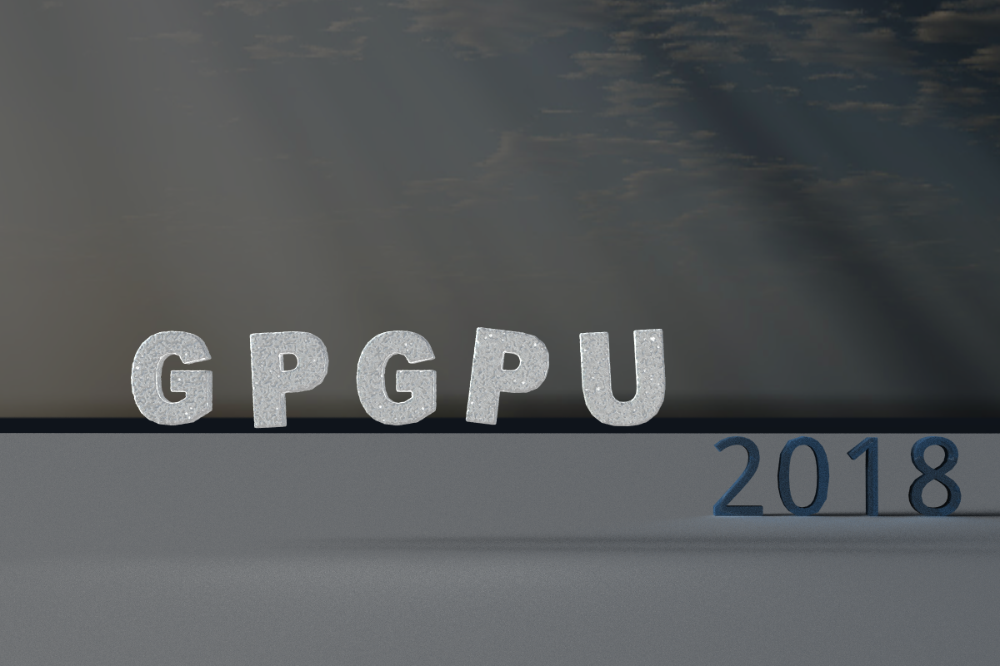
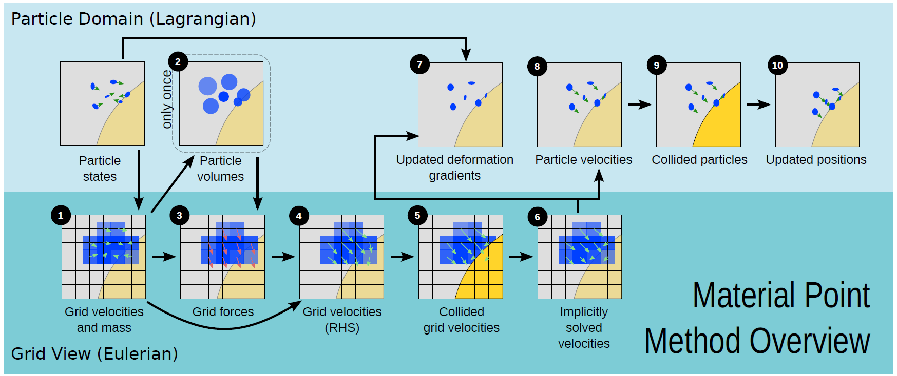
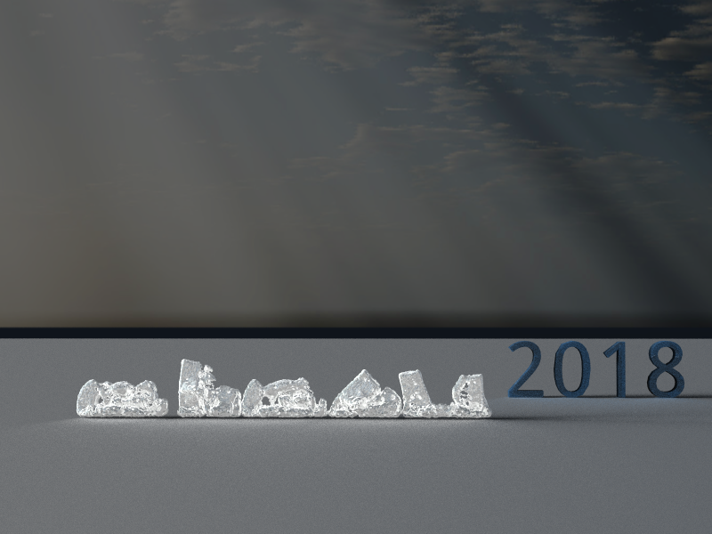
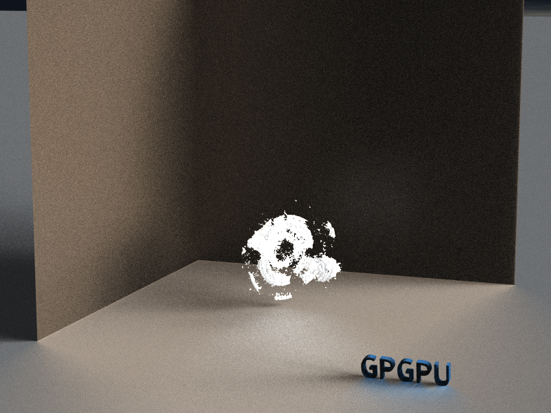

# MPM Simulation & Voxels Rendering



This is the final project for the course, *General-Purpose GPU Programming* @ NTU CSIE.

We model and simulate fluid-like materials, such as snow and sand, using material point method. MPM is implemented in C++ & CUDA. And OpenGL is used for real-time result viewing. Besides, for high quality rendering, we use NVIDIA GVDB + OptiX Ray Tracing Engine.

### Overview



The material point method (MPM) is a numerical technique used to simulate the behavior of solids, liquids, gases, and any other continuum material. In the MPM, a continuum body is described by a number of small Lagrangian elements referred to as 'material points'. These material points are surrounded by a background mesh/grid that is used only to calculate gradient terms such as the deformation gradient. For more information, please go to [Material point method - Wikipedia](https://en.wikipedia.org/wiki/Material_point_method)

### Implementations

For more details about implementation, please go to our [Project Page](https://windqaq.github.io/MPM/)

### Dependencies

##### Required

- CUDA
- [OpenGL](https://learnopengl.com/)
- [GLFW](http://www.glfw.org/)
- [OpenGL Mathematics (GLM)](https://glm.g-truc.net/0.9.9/index.html)

The following libraries has been put into this repository,

- [Eigen](http://eigen.tuxfamily.org/index.php?title=Main_Page)
- [svd3](https://github.com/ericjang/svd3)
- [stb_image](https://github.com/nothings/stb)
- [glad](https://github.com/Dav1dde/glad)

##### Optional

For high quality rendering as screenshots,

- [GVDB-Voxels](https://github.com/NVIDIA/gvdb-voxels)
- [NVIDIA OptiX](https://developer.nvidia.com/optix)

To generate videos from saved rendered frames,

- [FFmpeg](https://www.ffmpeg.org)

### How to Build

Source code are put in `inc/` and `src/`. To compile the simulation program, simply type `make`. Compiled objects would appear in `obj/`, and there would be the executable file in root directory of the repository.

To compile the rendering program, *GVDB-Voxels* library and *Nvidia OptiX* ray tracing engine are needed. So please build *gvdb-library* at first. Then build the code in directory, `gPointCloud/`, which is modified from the sample code. For more information, please go to [NVIDIA/gvdb-voxels](https://github.com/NVIDIA/gvdb-voxels).

### How to Run

First of all, run `make` to generate the executable. Then prepare your own configuration file with format as follows:
```
model=MODEL
```
where `MODEL` is a JSON file formatted as:
```json
{
  "model1": {
    "path": "PATH",
    "translate": [50.0, 0.0, 50.0],
    "scale": 0.5,
    "mass": 0.000026,
    "velocity": [0.0, -10.0, 0.0],
    "hardening": 15.0,
    "young": 1.4e5,
    "poisson": 0.2,
    "compression": 5.0e-2,
    "stretch": 5.0e-2
  }
}
```
The `PATH` is the ascii point cloud file where each line contains three values `x y z` seperated by a single space, and other parameters  depend on your model setting. Finally, run
```sh
./test --config CONFIG_FILE
```
to simulate using MPM and render with OpenGL!

### Screenshots

##### Letters falling scene



##### Two snow balls crashed each other



### References

##### Papers

- [Multi-species simulation of porous sand and water mixtures](https://www.math.ucla.edu/~jteran/papers/PGKFTJM17.pdf)
- [A material point method for snow simulation](https://www.math.ucla.edu/~jteran/papers/SSCTS13.pdf)

##### Other Implementations

- [Azmisov - snow](https://github.com/Azmisov/snow)
- [JAGJ10 - Snow](https://github.com/JAGJ10/Snow)
- [utilForever - SnowSimulation](https://github.com/utilForever/SnowSimulation)

### Contact

Issues and pull requests are welcomed, so are stars! ^_^ Feel free to contact project owner [Sung Tzu-Wei](mailto:windqaq@gmail.com), or contributors [Yist Lin](mailto:yishen992@gmail.com) and [Chen Li-Yu](mailto:jcly.rikiu@gmail.com).
